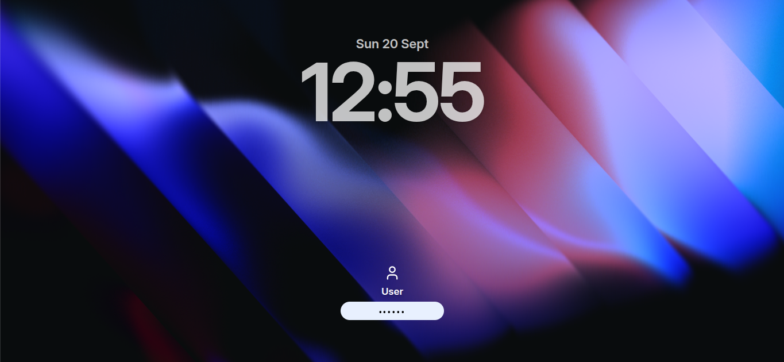
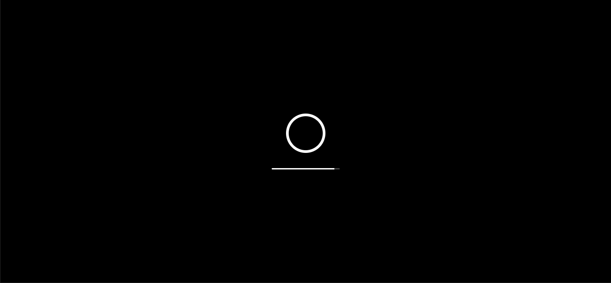
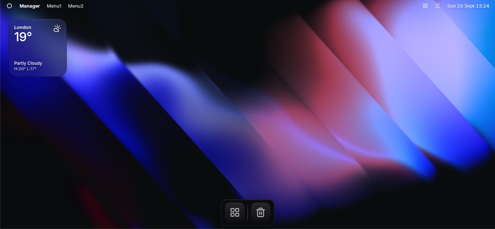

# Xenon-OS
Xenon-OS is a web-based operating system based on MacOS. It's designed to be lightweight, easy to run and something you can use anywhere.
Xenon-OS is a work in progress.

## Progress
### So far we've done:
* **Lock Screen** - Password protection with a background image, date and time.

**daschdrioooo.github.io/Xenon-OS/lockscreen/lockscreen.html**

* **Boot Screen** - Animated loading screen that uses CSS Keyframe animation for the loading bar

* **Authentication** - If you have not gone through a setup proceess and set up a password and username, you will be prompted to do so on first boot.

**daschdrioooo.github.io/Xenon-OS/boot/boot.html**

* **Desktop** - Main Xenon-OS desktop, with menus, apps (such as 'about') and more

**daschdrioooo.github.io/Xenon-OS/desktop/desktop.html**

* **Setup** - Setup page where you can set a username and password

**daschdrioooo.github.io/Xenon-OS/setup/setup.html**

## Contributors
* **DaschDrioooo** (Mostly HTML, CSS) - he/him/his  - github.com/daschdrioooo
* **Carbonicality** (Mostly JS, + some HTML and CSS) - he/him/his - github.com/carbonicality

## Additional Info

* **Site link** - daschdrioooo.github.io/Xenon-OS

* **Repository link** - github.com/daschdriooo/Xenon-OS

## Resources Used

* **Lucide icons** - lucide.dev

## Screenshots

### Setup Screen:

### Lock Screen:

### Boot Screen:

### Desktop:
